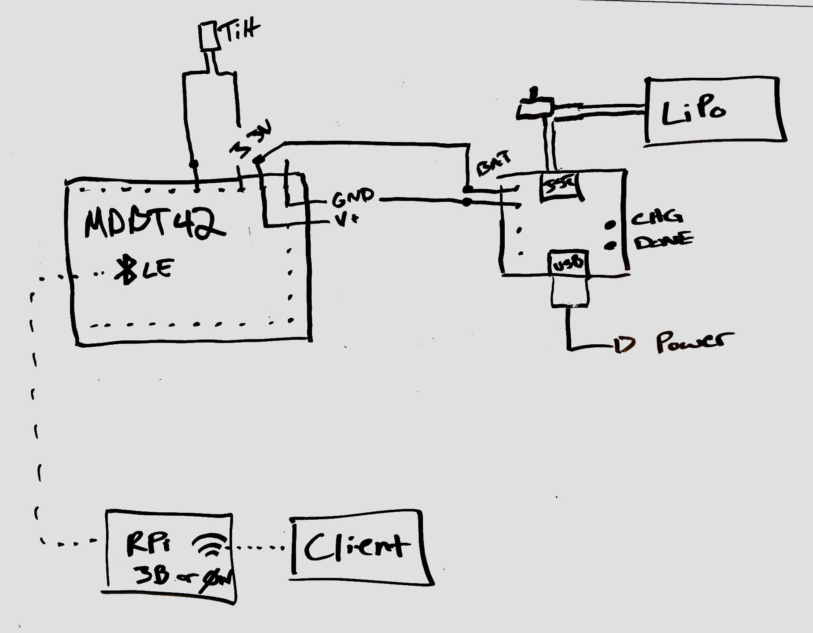
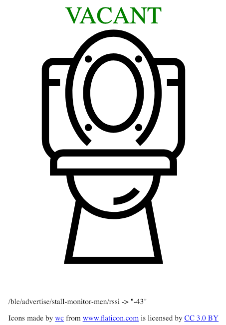
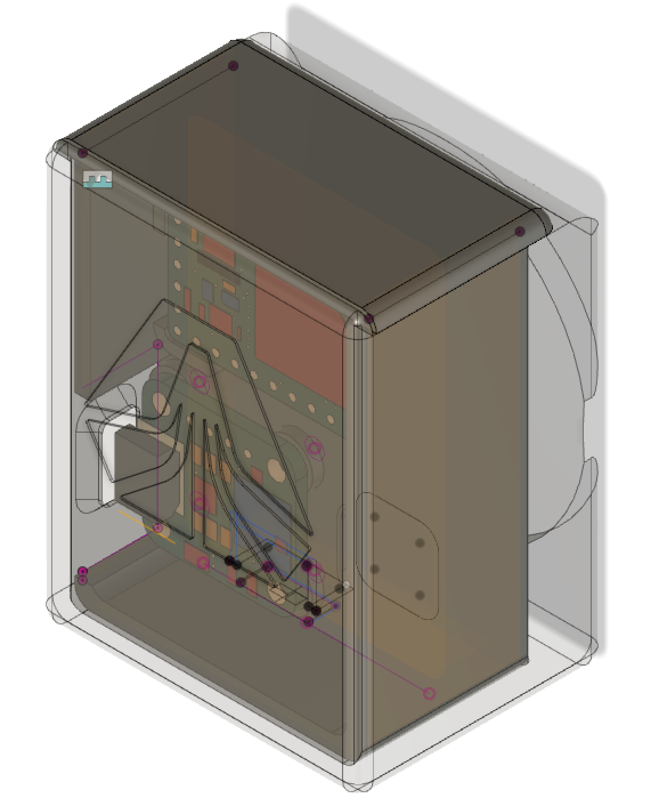
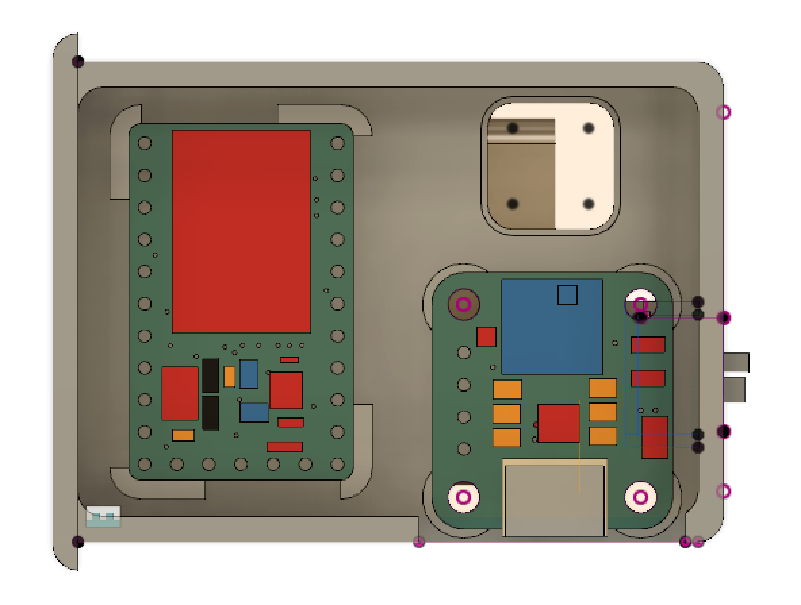

import { Split, Horizontal, Invert, SplitRigh, FullScreenCode} from 'mdx-deck/layouts'
import { Head, Image, Notes, Appear } from 'mdx-deck/dist'
import { Box, Text, Card, Flex } from 'rebass'

export { condensed as theme } from 'mdx-deck/themes'

import { library } from '@fortawesome/fontawesome-svg-core'
import { FontAwesomeIcon } from '@fortawesome/react-fontawesome'
import { faRaspberryPi, faNodeJs, faGithub, faSketch, faBluetoothB, faJs } from '@fortawesome/free-brands-svg-icons'
import { faRunning, faToilet, faThermometerHalf, faMobileAlt, faWifi, faUndo, faCode, faBatteryThreeQuarters, faPlus, faBed, faInfinity, faMousePointer } from '@fortawesome/free-solid-svg-icons'

# Remote Sensor Monitoring and Data Distribution

### or 

### How to Freak Out All Your CoWorkers!

---

>> eng·in·eer

> a person that solves problems you did not know you had

---

# The Problem

---

export default Horizontal

<div>
  <div>
    <FontAwesomeIcon icon={faRunning} size="3x"/>
    <FontAwesomeIcon icon={faRunning} size="3x"/>
    <FontAwesomeIcon icon={faRunning} size="3x"/>
    <FontAwesomeIcon icon={faRunning} size="3x"/>
    <FontAwesomeIcon icon={faRunning} size="3x"/>
    <FontAwesomeIcon icon={faRunning} size="3x"/>
    <FontAwesomeIcon icon={faRunning} size="3x"/>
    <FontAwesomeIcon icon={faRunning} size="3x"/>
    <FontAwesomeIcon icon={faRunning} size="3x"/>
    <FontAwesomeIcon icon={faRunning} size="3x"/>
  </div>
  <div>
    <FontAwesomeIcon icon={faRunning} size="3x"/>
    <FontAwesomeIcon icon={faRunning} size="3x"/>
    <FontAwesomeIcon icon={faRunning} size="3x"/>
    <FontAwesomeIcon icon={faRunning} size="3x"/>
    <FontAwesomeIcon icon={faRunning} size="3x"/>
    <FontAwesomeIcon icon={faRunning} size="3x"/>
    <FontAwesomeIcon icon={faRunning} size="3x"/>
    <FontAwesomeIcon icon={faRunning} size="3x"/>
    <FontAwesomeIcon icon={faRunning} size="3x"/>
    <FontAwesomeIcon icon={faRunning} size="3x"/>
  </div>
  <div>
    <FontAwesomeIcon icon={faRunning} size="3x"/>
    <FontAwesomeIcon icon={faRunning} size="3x"/>
    <FontAwesomeIcon icon={faRunning} size="3x"/>
    <FontAwesomeIcon icon={faRunning} size="3x"/>
    <FontAwesomeIcon icon={faRunning} size="3x"/>
    <FontAwesomeIcon icon={faRunning} size="3x"/>
    <FontAwesomeIcon icon={faRunning} size="3x"/>
    <FontAwesomeIcon icon={faRunning} size="3x"/>
    <FontAwesomeIcon icon={faRunning} size="3x"/>
    <FontAwesomeIcon icon={faRunning} size="3x"/>
  </div>
  <div>
    <FontAwesomeIcon icon={faRunning} size="3x"/>
    <FontAwesomeIcon icon={faRunning} size="3x"/>
    <FontAwesomeIcon icon={faRunning} size="3x"/>
    <FontAwesomeIcon icon={faRunning} size="3x"/>
    <FontAwesomeIcon icon={faRunning} size="3x"/>
    <FontAwesomeIcon icon={faRunning} size="3x"/>
    <FontAwesomeIcon icon={faRunning} size="3x"/>
    <FontAwesomeIcon icon={faRunning} size="3x"/>
    <FontAwesomeIcon icon={faRunning} size="3x"/>
    <FontAwesomeIcon icon={faRunning} size="3x"/>
  </div>
  <div>
    <FontAwesomeIcon icon={faRunning} size="3x"/>
    <FontAwesomeIcon icon={faRunning} size="3x"/>
    <FontAwesomeIcon icon={faRunning} size="3x"/>
    <FontAwesomeIcon icon={faRunning} size="3x"/>
    <FontAwesomeIcon icon={faRunning} size="3x"/>
    <FontAwesomeIcon icon={faRunning} size="3x"/>
    <FontAwesomeIcon icon={faRunning} size="3x"/>
    <FontAwesomeIcon icon={faRunning} size="3x"/>
    <FontAwesomeIcon icon={faRunning} size="3x"/>
    <FontAwesomeIcon icon={faRunning} size="3x"/>
  </div>
</div>

<FontAwesomeIcon icon={faToilet} size="10x"/>

---

# IoT to the Rescue

---

# Design Challenges

<h2><FontAwesomeIcon icon={faThermometerHalf}/>   Sensing</h2>
<h2><FontAwesomeIcon icon={faMobileAlt}/>   Acquisition & Presentation</h2>

---

# Presence Sensing

- Temperature - Infrared
- Distance - Ultrasonics
- Pressure - Switch on Seat
- Machine Vision

---

... Taking a step back

## Do we really need to measure PRESENCE
## or just AVAILABILITY?

---

What about ...

<h2>Door Position?</h2>

---

What about ...

<s>Door Position?</s>
<h2>Lock Position!</h2>

<Appear>
  <h2>Because who doesn't lock the door??</h2>
</Appear>

---

export default Invert

#### But in all seriousness, the lock is a rotating disc, which was super simple to measure with a tilt sensor

<br/><br/>

<Flex>
  
  
</Flex>

<Text fontSize={18}>Source: <a href='http://blog.vidianindhita.com/2018/02/27/all-about-tilt-switches/'>http://blog.vidianindhita.com/2018/02/27/all-about-tilt-switches/</a></Text>
<Text fontSize={18}>Source: <a href='https://learn.adafruit.com/tilt-sensor/overview'>https://learn.adafruit.com/tilt-sensor/overview</a></Text>

---

# Data Acquisition and Presentation

---

export default Split

<div>
  <h2>Arduino</h2>
  <br/>
  <FontAwesomeIcon icon={faInfinity} size="10x" />
</div>

<div>
  <h2>Raspberry Pi</h2>
  <br/>
  <FontAwesomeIcon icon={faRaspberryPi} size="10x" />
</div>

---

export default Horizontal

<div>
  <h1>Pi Zero W</h1>
  <FontAwesomeIcon icon={faRaspberryPi} size="8x" />
</div>

<div>
  <h1>WiFi</h1>
  <FontAwesomeIcon icon={faWifi} size="8x" />
</div>

---

export default Horizontal

<div>
  <h1>NodeJS + Express + RPIO</h1>
  <FontAwesomeIcon icon={faNodeJs} size="8x" />
</div>

<div>
  <h1>HTML + CSS + JS</h1>
  <FontAwesomeIcon icon={faCode} size="8x" />
</div>

---

export default FullScreenCode

```node
const rpio = require('rpio');
const express = require('express');
const app = express();

const STATUS_PIN = 11;

app.use(express.static('public'))

app.use(function(req, res, next) {
  res.header("Access-Control-Allow-Origin", "*");
  res.header("Access-Control-Allow-Headers", "Origin, X-Requested-With, Content-Type, Accept");
  next();
});

app.get('/stall', (req, res) => {
  const status = Boolean(rpio.read(STATUS_PIN));
  console.log(`${req.connection.remoteAddress} // Status: ${status}`);
  res.send({occupied: status});
});

rpio.open(STATUS_PIN, rpio.INPUT);

app.listen(3000, () => {
  console.log('stall-monitor is "Watching the Stall"');
}); 
```

---

# Final Product
<br/>

<br/>
<Text fontSize={18}>
  *Artist Rendering.  Sadly no pictures remain of this monstrosity.
  <br/>
  Source: <a href='http://www.se.edu/staff/cwood/2011/11/09/datacenter-remodel-complete/'>http://www.se.edu/staff/cwood/2011/11/09/datacenter-remodel-complete/</a>
</Text>
---

# Design Challenges V2

<h2><FontAwesomeIcon icon={faBatteryThreeQuarters}/>   Battery</h2>
<h2><FontAwesomeIcon icon={faPlus}/>   Performance / Stability</h2>
<h2><FontAwesomeIcon icon={faSketch}/>   Aesthetic</h2>

---

# Battery = Low Power

---
export default Horizontal

<div>
  <h1>(Deep) Sleep Mode</h1>
  <FontAwesomeIcon icon={faBed} size="8x" />
</div>

<div>
  <h1>Wifi vs. Bluetooth</h1>
  <FontAwesomeIcon icon={faWifi} size="8x" />
  <FontAwesomeIcon icon={faBluetoothB} size="8x" />
</div>

---


## Power Management
<br/>


<Text fontSize={18}>
  Source: <a href='https://www.electronicdesign.com/embedded-revolution/sleep-sense-connect-low-power-iot-design'>https://www.electronicdesign.com/embedded-revolution/sleep-sense-connect-low-power-iot-design</a>
</Text>

---

export default Split

# Embedded Controllers

<Box m={50}>
  <h1>Espressif</h1>
  <hr/>
  <h2>ESP8266</h2>
  <h2>ESP32</h2>
</Box>
<br/>
<Box m={50}>
  <h1>Nordic</h1>
  <hr/>
  <h2>nRF51/52</h2>
  <h4> Worth Mentioning: nRF91</h4>
</Box>

<Notes>
  ESP8266 - Wifi, GPIO, ADC/DAC, Protocols
  ESP32 - Wifi, Bluetooth 4, Encryption, ADC/DAC, GPIO, Protocols
  nRF51/52 - Bluetooth 5, NFC, Encryption, ADC/DAC, GPIO, Protocols (SPI. I2C, I2S, UART, 2 wire, more!)
  nRF91 - Cellular!!
</Notes>

---

export default Split


<div>
  <h1>Espruino</h1>
  <h1>Embedded Boards that run JS!</h1>
</div>


<Text fontSize={18}>
  Source: <a href='https://www.espruino.com/MDBT42Q'>https://www.espruino.com/MDBT42Q</a>
</Text>

- MDBT42Q (BLE)
- Pico (Tiny)
- Puck (BLE + Housing + Sensors)
- Pixl (BLE + Screen)
- Wifi
- IDE

---

export default Split

# System Architecture



---

# Performance = No Polling

---

# [EspruinoHub](https://github.com/espruino/EspruinoHub)

## A BLE -> MQTT bridge for Raspberry Pi and other Embedded devices

---

# MQTT

- Popular IoT transport protocol
- Bi-directional Publish-Subscribe
- Optimized for low power, small packets, reliability
- Channels for status, battery, previous state duration

---

# Code Update
<FontAwesomeIcon icon={faJs} size="10x" />

---

export default FullScreenCode

```javascript
const SENSOR = D14;
var state = false;
var time = getTime();
var newTime = 0;
var options = {
  name: "Skookum Stall Monitor",
  interval:1000,
  manufacturer:0x0590
};

function setAdvertisingData(doorState, duration) {
  options.manufacturerData = JSON.stringify({
    l: doorState ? 1 : 0,
    d: Math.round(duration)
  });
    
  NRF.setAdvertising({
      0x180F : [Math.round((NRF.getBattery()-2.5)/0.8*100)]
    }, options
  );
}

// Initialization

pinMode(D14, 'input_pulldown');
NRF.setLowPowerConnection(true);
setAdvertisingData(!SENSOR.read(), 0);

// Main

setWatch(function(e) {
  if(state !== e.state) {
    newTime = getTime();

    setAdvertisingData(!e.state, newTime - time);
    
    time = newTime;
  }
  
  state = e.state;
}, SENSOR, { repeat: true, edge: 'both', debounce: 1000 });
```

```notes
NRF.setLowPowerConnection()
setWatch()

NRF.getBattery()
```

---

# Client Update



---

export default FullScreenCode

```javascript
const http = new XMLHttpRequest();
const url = "http://10.1.5.135:3000/stall";

function setBathroomStatus(occupied) {
  document.getElementById('toilet').style.display = 'block';
  document.getElementById('occupied').style.display = occupied ? 'block' : 'none';
  document.getElementById('vacant').style.display = occupied ? 'none' : 'block';
};

function log(msg) {
  document.getElementById('log').textContent = msg;
}
    
// Create a client instance
client = new Paho.MQTT.Client(
  location.hostname||"10.1.5.121",
  parseInt(location.port||1888),
  location.pathname.substr(0,location.pathname.lastIndexOf("/")+1),
  Math.random().toString(36).substring(7)
);

// set callback handlers
client.onConnectionLost = onConnectionLost;
client.onMessageArrived = onMessageArrived;
log("MQTT Connecting...");

// connect the client
client.connect({onSuccess:onConnect});

// called when the client connects
function onConnect() {
log("MQTT Connected");
  client.subscribe("#"); // get everything
}

// called when the client loses its connection
function onConnectionLost(responseObject) {
  if (responseObject.errorCode !== 0) {
    document.getElementById('toilet').style.display = 'none';
    log("MQTT connection lost:"+responseObject.errorMessage);
  }
}

// called when a message arrives
function onMessageArrived(message) {
  log(""+message.destinationName+"  ->  "+JSON.stringify(message.payloadString));
  if (message.destinationName.startsWith("/ble/advertise/stall-monitor-men/l")) {
    // console.log(message.destinationName, ": ", message.payloadString);
    setBathroomStatus(message.payloadString === "1");
  }
}
```

---

export default Horizontal

<div>
  <h1>3D Case Printing</h1>
  <hr/>
  <h1>Fusion 360</h1>
</div>





---

export default Horizontal

<div>
  <h1>3D Case Printing</h1>
  <hr/>
  <h1>Makerbot Print</h1>
</div>


---

# Be agile they said,
# iterate they said


---

# Final Product


---

<h1>
  <FontAwesomeIcon icon={faMousePointer} />
  <span> </span>
  <a href="">Stall Monitor</a>
</h1>

<h1>
  <FontAwesomeIcon icon={faGithub} />
  <span> </span>
  <a href="https://github.com/drewterry/evacuation-occupation-sensor">Github Repo</a>
</h1>

---

### This presentation was built with:

<h1><a href='https://jxnblk.com/mdx-deck'>mdx-deck</a></h1>

# &

<h1><a href='https://rebassjs.org'>Rebass</a></h1>
